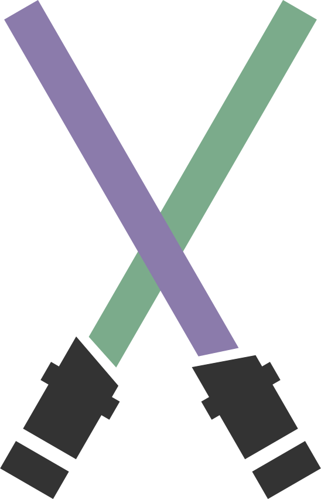
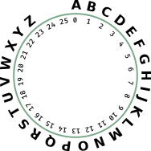
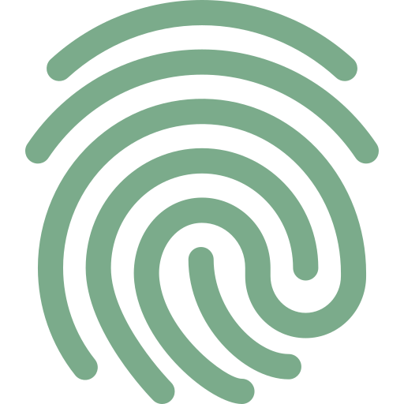
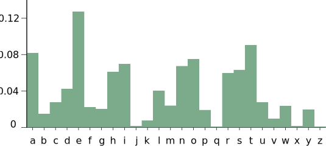

# Introduction {data-background=#7BAB8B}

## What is Cryptography?
Cryptography is the art & science of keeping messages secure 🔒️

```
Crypto + Graphy = Secret + Writing
```

>- **Plaintext**: The secret message.
>- **Ciphertext**: The encrypted message.
>- **Encryption**: Disguising a message to hide its contents.
>- **Decryption**: The process of turning ciphertext back into plaintext.

<aside class="notes">
The main objective of cryptography is to conceal data and messages from eavesdroppers.

- What can be encrypted?
- Do *messages* only refer to text?
- Can images be encrypted
</aside>

## Who needs Encryption?
<p style="font-size:4em">👩‍⚕️️🕵‍👩‍💻️👮️🏦️</p>
. . .

```
Everyone.
```
<aside class="notes">
- Who do you think needs encryption?
</aside>

## What can it be used for?
Cryptography is not only used for sending secret messages.

>- Privacy / Confidentiality ✉️
>- Authentication 🗝️
>- Anonymity 🕵‍
>- Signature / Certification 🔏️

## Mass Surveillance
"*If you have nothing to hide, you have nothing to fear.*"

<iframe width="700" height="400" src="https://www.youtube-nocookie.com/embed/V9_PjdU3Mpo?start=152" frameborder="0" allow="accelerometer; encrypted-media; gyroscope; picture-in-picture" allowfullscreen></iframe>

<aside class="notes">
- What does NSA stand for?
- Why did the FBI ask Apple to decrypt a phone?
- What is a backdoor?
- Why didn't Apple follow suit with this request?

</aside>

## 
Governments are trying to [limit access](https://www.eff.org/document/crypto-wars-governments-working-undermine-encryption) to cryptography.

. . .

:::::::::::::: {.columns}
::: {.column width="40%"}
#### [Cypherpunks](https://activism.net/cypherpunk/manifesto.html)
```
We the Cypherpunks are defending our privacy with cryptography.
```
:::
::: {.column width="20%"}

:::
::: {.column width="40%"}
<h4 id="NSA" style="color:#8b7bab">NSA</h4>

- [Clipper chip](https://en.wikipedia.org/wiki/Clipper_chip)
- [Edward Snowden](https://en.wikipedia.org/wiki/Edward_Snowden) revealed that the NSA sabotages encryption
:::
::::::::::::::

<aside class="notes">
- Why do you think that governments would like to limit access to cryptography?
- In the 1990s the NSA promoted the [clipper chip](https://en.wikipedia.org/wiki/Clipper_chip) to give the government backdoor keys
- Although courts, Congress, and the public opinion all opposed this, NSA undermines this in secret
- The NSA was revealed to insert hidden vulnerabilities into our security standards and systems
</aside>

## [Quiz-Time!](https://create.kahoot.it/share/cryptography-i/3d21faeb-db61-48e4-8446-a0e20ce1813f)


# Classical Ciphers {data-background=#7BAB8B}

## Caesar Cipher 

Julius Caesar used a form of **substitution cipher** <br> to send messages to his troops.

<!-- | A | B | C | D | E | F | G | H | I | J | K | L | M | N | O | P | Q | R | S | T | U | V | W | X | Y | Z |
|---|---|---|---|---|---|---|---|---|---|---|---|---|---|---|---|---|---|---|---|---|---|---|---|---|---|
| D | E |   |   |   | I |   | K |   |   |   | O |   |   | R | S | T |   |   | W |   | Y |   |   |   | C | -->

<table>
<thead>
  <tr>
    <th>A</th>
    <th>B</th>
    <th>C</th>
    <th>D</th>
    <th>E</th>
    <th>F</th>
    <th>G</th>
    <th>H</th>
    <th>I</th>
    <th>J</th>
    <th>K</th>
    <th>L</th>
    <th>M</th>
    <th>N</th>
    <th>O</th>
    <th>P</th>
    <th>Q</th>
    <th>R</th>
    <th>S</th>
    <th>T</th>
    <th>U</th>
    <th>V</th>
    <th>W</th>
    <th>X</th>
    <th>Y</th>
    <th>Z</th>
  </tr>
</thead>
<tbody>
  <tr>
    <td contenteditable='true'>D</td>
    <td contenteditable='true'>E</td>
    <td contenteditable='true'></td>
    <td contenteditable='true'></td>
    <td contenteditable='true'></td>
    <td contenteditable='true'>I</td>
    <td contenteditable='true'></td>
    <td contenteditable='true'>K</td>
    <td contenteditable='true'></td>
    <td contenteditable='true'></td>
    <td contenteditable='true'></td>
    <td contenteditable='true'>O</td>
    <td contenteditable='true'></td>
    <td contenteditable='true'></td>
    <td contenteditable='true'>R</td>
    <td contenteditable='true'>S</td>
    <td contenteditable='true'>T</td>
    <td contenteditable='true'></td>
    <td contenteditable='true'></td>
    <td contenteditable='true'>W</td>
    <td contenteditable='true'></td>
    <td contenteditable='true'>Y</td>
    <td contenteditable='true'></td>
    <td contenteditable='true'></td>
    <td contenteditable='true'></td>
    <td contenteditable='true'>C</td>
  </tr>
</tbody>
</table>

<textarea rows="3" cols="40">Khoor iurp wkh sdvw</textarea>

## Cipher Wheel
Make your own Caesar cipher 🖌️

<iframe height="500" width="850" data-src="http://inventwithpython.com/cipherwheel/"></iframe>

<aside class="notes">
- Encrypt your favourite ...
- Send me a encrypted message but don't tell me they key
- Automatically [decrypt](https://www.xarg.org/tools/caesar-cipher/)
</aside>

## Permutation Cipher


Can you decipher the message in [this challenge](https://go.joincyberstart.com)?

<aside class="notes">
Column Confusion
</aside>

## Vigenère Cipher

<!-- https://ljd42.files.wordpress.com/2015/10/d85e4-alphabetclock.jpg -->

<table>
<thead>
  <tr>
    <th>T<sub>19</sub></th>
    <th>H<sub>7</sub></th>
    <th>E<sub>4</sub></th>
    <th>S<sub>18</sub></th>
    <th>E<sub>4</sub></th>
    <th>C<sub>2</sub></th>
    <th>R<sub>17</sub></th>
    <th>E<sub>4</sub></th>
    <th>T<sub>19</sub></th>
    <th>M<sub>12</sub></th>
    <th>E<sub>4</sub></th>
    <th>S<sub>18</sub></th>
    <th>S<sub>18</sub></th>
    <th>A<sub>0</sub></th>
    <th>G<sub>6</sub></th>
    <th>E<sub>4</sub></th>
  </tr>
</thead>
<tbody>
  <tr>
    <td>P<sub>15</sub></td>
    <td>A<sub>0</sub></td>
    <td>S<sub>18</sub></td>
    <td>S<sub>18</sub></td>
    <td>W<sub>22</sub></td>
    <td>O<sub>14</sub></td>
    <td>R<sub>17</sub></td>
    <td>D<sub>3</sub></td>
    <td>P<sub>15</sub></td>
    <td>A<sub>0</sub></td>
    <td>S<sub>18</sub></td>
    <td>S<sub>18</sub></td>
    <td>W<sub>22</sub></td>
    <td>O<sub>14</sub></td>
    <td>R<sub>17</sub></td>
    <td>D<sub>3</sub></td>
  </tr>
  <tr>
    <td contenteditable='true'>I</td>
    <td contenteditable='true'>H</td>
    <td contenteditable='true'> </td>
    <td contenteditable='true'> </td>
    <td contenteditable='true'> </td>
    <td contenteditable='true'> </td>
    <td contenteditable='true'> </td>
    <td contenteditable='true'> </td>
    <td contenteditable='true'> </td>
    <td contenteditable='true'> </td>
    <td contenteditable='true'> </td>
    <td contenteditable='true'> </td>
    <td contenteditable='true'> </td>
    <td contenteditable='true'> </td>
    <td contenteditable='true'> </td>
    <td contenteditable='true'> </td>
  </tr>
</tbody>
</table>

<aside class="notes">
- Encrypt your favourite ...
- What key would we need to recover the Caesar cipher?
</aside>


# Cryptanalysis {data-background=#7BAB8B}

## Code
> A **code** is a system of rules to convert information (letters, sounds, images) into another form of representation.

:::::::::::::: {.columns}
::: {.column width="33%"}
01011100010101001
10100011011010110
01101100101010001
00001101001011101
:::
::: {.column width="33%"}

:::
::: {.column width="33%"}

:::
::::::::::::::

<aside class="notes">
- What is a code?
- What examples of codes do you know?
- Is a code a form of encryption?
</aside>

## Fingerprint Challenge


Can you hack the password in [this challenge](https://go.joincyberstart.com)?

>- How many combinations are there?
>- Come up with a strong password that you can easily remember
>- How strong is it? [Check it](https://howsecureismypassword.net/)

<aside class="notes">
**Brute-Force Attack**: Attempting as many guesses in as little time as possible.

One of the fastest supercomputers could theoretically check 100 million million (10^14) AES keys per second (assuming 1000 operations per check), but would still require 3.67×10^52 years to exhaust the 256-bit key space. 
</aside>

## Breaking the Caesar Cipher
We have intercepted an encrypted message. Can you decrypt it?
```
Ogo qgm sjw s hjwllq kesjl zsucwj
```
. . .



<aside class="notes">
- Can you think of smarter ways to breach cryptographic security systems?
- Frequency analysis leverages that in a given language letters occur with different frequencies.
- What do you think is the most common way of hacking someone? Social engineering.
</aside>

## [Quiz Time](https://create.kahoot.it/share/cryptography-ii/27b08e85-d032-4a2b-a966-d40c1878077d)

# Modern Cryptography {data-background=#7BAB8B}

## Public-key Cryptography
Modern cryptosystems make heavy use of [public key](https://en.wikipedia.org/wiki/Public-key_cryptography) algorithms.


<aside class="notes">
```
Bob wants to send an encrypted message to Alice without Eve being able to decrypt it. Eve can see all the messages Alice and Bob exchange with each other. Alice has a safe only she knows the combination to. The safe can be sent around like any other message.
```

- What does the "https://" of an url stand for?
</aside>

## Key Exchange
The [Diffie–Hellman key exchange](https://en.wikipedia.org/wiki/Diffie%E2%80%93Hellman_key_exchange) algorithm allows to securely exchange keys over a public channel. 


## [Contact Tracing](https://ncase.me/contact-tracing/)